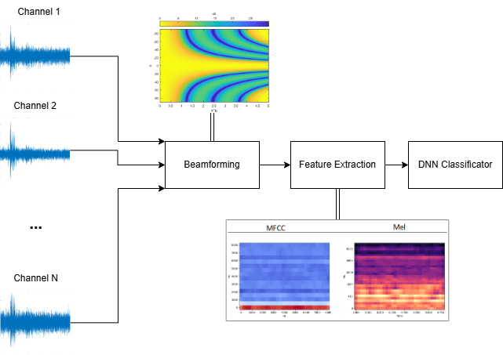

# add-app
_Acoustic Drone Detection Application_

## How does it work

The application processes the signal received from the microphone array. Processing consists of extracting an MFCC or mel-spectrogram depending on the configuration. The extracted feature is fed to a neural network classifier.


## Installation 

Required Python version <= 3.9.19 (Anaconda is highly recommended).

First of all install tensorflow dependencies. Please check the [tensorflow installation guide](https://www.tensorflow.org/install/). For optimal performance it is recommended to run the code using a CUDA enabled GPU.

To install requirements:
```
pip install -r requirements.txt
```
The code was tested with Python 3.9.19 the following software versions:

| Software      | version | 
| ------------- |-------------| 
| cuDNN | 8.1.0.77 |
| tensorflow | 2.10.1 |
| CUDA | 12.6 |

To start application run:
```
python mainwindow.py
```

## License

This project is licensed under the GNU General Public License v3.0 - see the [LICENSE.md](LICENSE.md) file for details.
